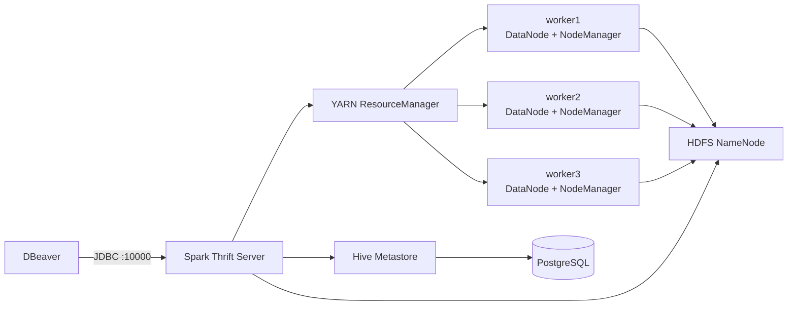

# Кластер Hadoop, Spark и Iceberg в Docker

[](https://github.com/RuslanAyvazov/hadoop_iceberg_spark/actions/workflows/validate.yml)
[](https://github.com/RuslanAyvazov/hadoop_iceberg_spark/actions/workflows/publish-images.yml)

Учебный распределённый кластер: три HDFS-узла, три вычислительных узла YARN,
Spark SQL, Apache Iceberg, Parquet и Hive Metastore. Всё запускается через
Docker Compose, после чего к Spark SQL можно подключиться из DBeaver на Windows.

## Быстрый запуск

Понадобятся:

- Docker Desktop или Docker Engine;
- Docker Compose версии 2;
- не менее 12 ГБ памяти, доступной Docker, желательно 16 ГБ;
- около 20 ГБ свободного места для образа и данных;
- свободные порты `4040`, `8088`, `9870`, `10000` и `18080`.

Склонируйте репозиторий и запустите кластер:

```bash
git clone https://github.com/RuslanAyvazov/hadoop_iceberg_spark.git
cd hadoop_iceberg_spark/hadoop_iceberg_spark_cluster
docker compose up -d
docker compose ps
```

При первом запуске Docker скачивает готовый образ, форматирует новый HDFS,
регистрирует три рабочих узла, создаёт схему Hive Metastore и отправляет Spark
Thrift Server на выполнение через YARN. Если готовый образ недоступен, Compose
может собрать его локально из `Dockerfile`.

Кластер готов, когда все десять сервисов имеют состояние `healthy`:

```text
postgres             healthy
namenode             healthy
secondarynamenode    healthy
worker1              healthy
worker2              healthy
worker3              healthy
resourcemanager      healthy
metastore            healthy
thriftserver          healthy
historyserver         healthy
```

Следить за последним этапом запуска:

```bash
docker compose logs -f thriftserver
```

## Готовый образ и локальная сборка

Все Java-сервисы кластера используют один готовый образ для `linux/amd64`:

```text
ghcr.io/ruslanayvazov/hadoop-iceberg-spark-cluster:3.3.6-3.5.4
```

Явно скачать его и исключить локальную сборку:

```bash
docker compose pull
docker compose up -d --no-build
```

Собрать образ самостоятельно:

```bash
docker compose up -d --build
```

## Подключение DBeaver

Создайте подключение с драйвером Apache Hive:

| Параметр | Значение |
|---|---|
| Сервер (Host) | `localhost` |
| Порт (Port) | `10000` |
| База или схема | `default` |
| Пользователь | `hive` |
| Пароль | оставить пустым |

Полный адрес JDBC — стандартного интерфейса подключения Java-приложений к
базам данных:

```text
jdbc:hive2://localhost:10000/default;auth=noSasl
```

Проверочный запрос:

```sql
CREATE NAMESPACE IF NOT EXISTS spark_catalog.demo;

CREATE TABLE IF NOT EXISTS spark_catalog.demo.events (
    id BIGINT,
    message STRING,
    created_at TIMESTAMP
)
USING iceberg;

INSERT INTO spark_catalog.demo.events
SELECT id, concat('distributed row ', CAST(id AS STRING)), current_timestamp()
FROM range(1, 13);

SELECT COUNT(*) FROM spark_catalog.demo.events;
```

Некоторые версии DBeaver автоматически отправляют `SHOW INDEX ON`. Spark SQL
не поддерживает эту команду и может показать синтаксическую ошибку. Это не
мешает выполнению обычных запросов и работе с таблицами.

## Автоматическая проверка

В Linux или WSL:

```bash
bash scripts/smoke-test.sh
```

В Windows PowerShell:

```powershell
.\scripts\smoke-test.ps1
```

Проверка выполняет всю цепочку:

1. Проверяет три активных YARN NodeManager.
2. Подключается к Spark Thrift Server по JDBC.
3. Создаёт Iceberg-таблицу и записывает данные в Parquet.
4. Читает снимок состояния Iceberg.
5. Запускает `hdfs fsck` и показывает три реплики каждого HDFS-блока.

## Веб-интерфейсы

| Сервис | Адрес | Что показывает |
|---|---|---|
| HDFS NameNode | http://localhost:9870 | Файлы, блоки и DataNode |
| YARN ResourceManager | http://localhost:8088 | Узлы, ресурсы и приложения |
| Активный Spark Thrift Server | http://localhost:4040 | Задания, этапы и исполнители Spark |
| Spark History Server | http://localhost:18080 | История завершённых приложений |

## Архитектура



На каждом рабочем узле совместно запущены:

- DataNode — процесс, который хранит HDFS-блоки;
- NodeManager — процесс YARN, который запускает вычислительные контейнеры
  Spark.

HDFS использует коэффициент репликации `3`: каждый блок данных хранится на
трёх разных DataNode.

## Состав и версии

| Компонент | Версия | Назначение |
|---|---:|---|
| Hadoop HDFS и YARN | 3.3.6 | Хранение файлов и распределение ресурсов |
| Spark SQL | 3.5.4 | Распределённое выполнение SQL-запросов |
| Spark Thrift Server | 3.5.4 | Подключение DBeaver по JDBC |
| Apache Iceberg | 1.6.1 | Формат таблиц и управление снимками состояния |
| Parquet | 1.13.1 | Колоночное хранение файлов данных |
| Hive Metastore | 3.1.3 | Каталог баз, таблиц и расположений файлов |
| PostgreSQL | 16 | База данных Hive Metastore |
| Java | 17 | Среда выполнения Hadoop и Spark |

## Как Spark использует кластер

Spark Thrift Server запускается с:

```text
spark.master=yarn
spark.submit.deployMode=client
spark.executor.instances=3
```

Режим размещения `client` означает, что управляющий процесс Spark находится в
контейнере `thriftserver`. Сами вычисления выполняют три процесса-исполнителя,
которые YARN размещает на рабочих узлах. Поэтому SQL-запросы из DBeaver
обрабатываются распределённо.

Для обычных приложений доступен режим размещения `cluster`: управляющий процесс
также запускается внутри YARN, и отправивший команду клиент может завершиться.

Проверить этот режим примером SparkPi:

```bash
bash scripts/cluster-pi.sh
```

В Windows PowerShell:

```powershell
.\scripts\cluster-pi.ps1
```

Эквивалентная команда:

```bash
docker compose exec thriftserver spark-submit \
  --master yarn \
  --deploy-mode cluster \
  --driver-memory 512m \
  --executor-memory 512m \
  --num-executors 1 \
  --class org.apache.spark.examples.SparkPi \
  /opt/spark/examples/jars/spark-examples_2.12-3.5.4.jar 20
```

## Эксперимент с отказом узла

Сначала создайте тестовую таблицу:

```bash
bash scripts/smoke-test.sh
```

Затем остановите один рабочий узел:

```bash
docker compose stop worker3
docker compose exec namenode hdfs dfsadmin -report
docker compose exec namenode hdfs fsck /warehouse -files -blocks -locations
```

Через некоторое время HDFS покажет один недоступный DataNode и блоки только с
двумя живыми репликами. Данные останутся доступны. В кластере ровно три
DataNode, поэтому свободного четвёртого узла для восстановления третьей копии
нет.

Вернуть узел:

```bash
docker compose start worker3
docker compose exec namenode hdfs dfsadmin -report
```

После регистрации `worker3` третьи реплики снова станут доступны.

## Где сохраняются данные

Docker создаёт шесть именованных томов — хранилищ, которыми управляет сам
Docker:

```text
hadoop-iceberg-spark-cluster_postgres-data
hadoop-iceberg-spark-cluster_namenode-data
hadoop-iceberg-spark-cluster_secondarynamenode-data
hadoop-iceberg-spark-cluster_worker1-data
hadoop-iceberg-spark-cluster_worker2-data
hadoop-iceberg-spark-cluster_worker3-data
```

`worker1-data`, `worker2-data` и `worker3-data` содержат физические HDFS-блоки
и рабочие каталоги YARN. Parquet-файлы и служебные файлы Iceberg логически
доступны по адресу:

```text
hdfs://namenode:9820/warehouse
```

Остановить кластер, сохранив данные:

```bash
docker compose down
```

Полностью удалить кластер вместе со всеми данными:

```bash
docker compose down -v
```

Флаг `-v` необратимо удаляет HDFS и базу Hive Metastore.

## Настройка ресурсов и портов

Создайте `.env` из примера:

```bash
cp .env.example .env
```

Для Windows PowerShell:

```powershell
Copy-Item .env.example .env
```

Через `.env` можно изменить опубликованные порты, память управляющего процесса
Spark, количество исполнителей и их ресурсы:

```dotenv
HIVE_JDBC_PORT=10000
SPARK_DRIVER_MEMORY=1g
SPARK_EXECUTOR_INSTANCES=3
SPARK_EXECUTOR_CORES=1
SPARK_EXECUTOR_MEMORY=512m
```

Каждый NodeManager объявляет YARN `2048` МБ памяти и `2` виртуальных
процессорных ядра. Эти значения находятся в
[`conf/hadoop/yarn-site.xml`](conf/hadoop/yarn-site.xml).

Общие настройки Spark находятся в
[`conf/spark/spark-defaults.conf`](conf/spark/spark-defaults.conf). После
изменения файлов конфигурации пересоберите образ:

```bash
docker compose up -d --build
```

Параметры отдельного подключения DBeaver задаются командами SQL:

```sql
SET spark.sql.shuffle.partitions=24;
SET spark.sql.adaptive.enabled=true;
```

## Диагностика

```bash
# Состояние контейнеров
docker compose ps

# Три HDFS DataNode и состояние реплик
docker compose exec namenode hdfs dfsadmin -report

# Три YARN NodeManager
docker compose exec resourcemanager yarn node -list -states RUNNING

# Приложения Spark в YARN
docker compose exec resourcemanager yarn application -list -appStates ALL

# Логи Spark Thrift Server
docker compose logs -f thriftserver
```

Если порты заняты, измените их в `.env`. Если контейнеры не получают состояние
`healthy`, начните с `docker compose logs --tail=200`.

## Ограничения учебного кластера

Контейнеры изображают отдельные серверы, но физически работают на одном
компьютере и используют один диск. Поэтому стенд позволяет изучать HDFS,
репликацию, YARN и распределённое выполнение Spark, но не измерять настоящую
производительность или устойчивость к отказу физического сервера.

## Безопасность

Стенд предназначен для локальной разработки и обучения. Веб-интерфейсы и JDBC
опубликованы только на `127.0.0.1`, PostgreSQL доступен лишь внутри Docker-сети.
Не публикуйте эти порты в интернет и замените стандартные пароли перед
использованием в общей сети.
